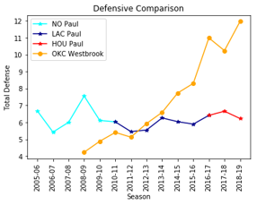

# The Trade: Paul vs. Westbrook
## Project members: Sanjay Suresh, Mitsuko Kitazawa, Nicolas Gomez Bustamante, Nicholas Keller

**Project objectives:**
        Determine which stats should be used to compare players.  
        Analyze and compare results for Chris Paul and Russel Westbrook.  
        Determine who is the best asset for Houston Rockets. 

**Backround:**
       This off-season Chris Paul was traded to the Thunders for Russel Westbrook (OKC).  
       Chris Paul is a good performer and Russel Westbrook is more controversial.  
       Is trading C. Paul for Westbrook a good deal? 
       
**Data:** 
      NBA api stats.nba.com (no key needed)  
      This data is recorded by the NBA, so it is therefore the most accurate

**Analysis:**  
Linear Regression was used to first find a correlation between a common player stat (Plus Minus(+/-))  and a players Win Percentage since winning is the goal  
We then used linear regression to see if there was a correlation between a players +/- and the other stats a player records  
  
**Chris Paul:**  
  
**Russell Westbrook:**   
  

**Team Comparison:**  

  
Rockets in general had higher number of wins than Thunders
Both teams were a better away team
Their records overall were similar

**Player Comparison:**  
Offense

  
  

  
Defense  

## Conclusions
Westbrook fills a different type of role than Chris Paul does because of how different the 2 players are.  
At this point in their careers, Westbrook provides the most value based on his statistics on the offense and defensive side of the ball 
Westbrook regularly scores more points and rebounds more balls in a game than Chris Paul, which provides more opportunities for his team to score.  
The statistical analysis shows us that there are many variables in a basketball game that can make it impossible to quantify players against players that are in different situations on their team.

